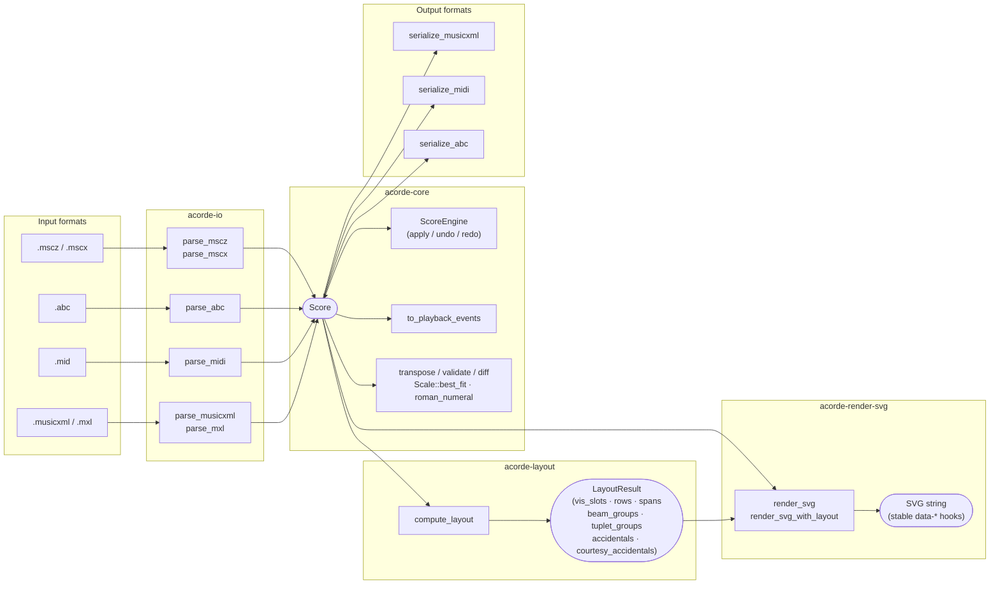
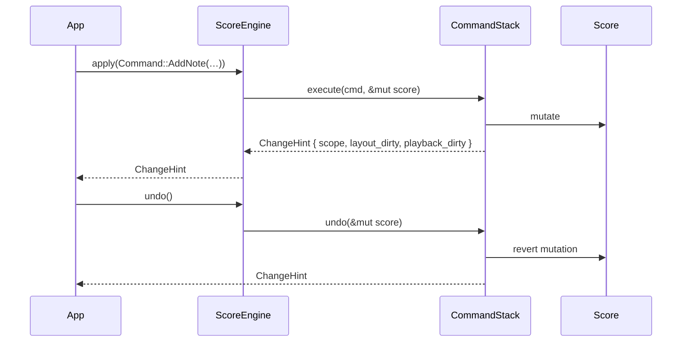

# acorde

> Platform-agnostic music score library for Rust and WebAssembly.

[](https://crates.io/crates/acorde)
[](https://docs.rs/acorde)
[](https://github.com/kent-tokyo/acorde/actions/workflows/ci.yml)


---

## Overview

**acorde** is a pure-Rust music score library covering the full notation pipeline:
score model · command engine · MusicXML/MIDI/ABC I/O · logical layout · WebAssembly bindings · CLI.

It has zero UI dependencies and no filesystem access in the core crates — renderers and host
applications (desktop, web, server) consume the library and handle I/O at the boundary.

<!-- Drop a screenshot of your score editor (e.g. MusicLav) here. -->
<!-- Replace the placeholder below with the real image path once you add the file. -->
<!-- Example:  -->

---

## Architecture

### Pipeline



### Score data model

```
Score
├── metadata  { title, composer, lyricist, copyright, … }
├── settings  { tempo_bpm, time_signature, key_signature }
├── part_groups  Vec<PartGroup>
└── parts     Vec<Part>
    ├── midi_channel / midi_program
    └── staves  Vec<Staff>
        ├── clef
        ├── transpose_semitones  (transposing instruments)
        └── measures  Vec<Measure>
            ├── time_sig / key_sig / clef / tempo
            ├── barline_left / barline_right
            ├── volta / rehearsal / navigation / expression_text
            └── voices  [Vec<Note>; 4]
                └── Note
                    ├── pitches       Vec<Pitch>  (chord = multiple pitches)
                    ├── duration / dot_count / tuplet
                    ├── is_rest / is_grace / is_cue
                    ├── tie_start / slur_start / hairpin_start / ottava_start
                    ├── dynamic / articulations / lyric / chord_symbol
                    ├── stem_up / note_head / fingering / technique_text
                    └── guitar_technique / arpeggiate / trill_line_start
```

### Command flow (undo / redo)



---

## Why acorde?

### Edit history is a first-class citizen
Every mutation is a serializable `Command` enum stored in a `CommandStack`.
This means undo/redo works out of the box, but also that edit history can be persisted to disk,
replayed deterministically, or streamed over a network — without any extra infrastructure.

### The same code runs natively and in the browser
`acorde-core` and `acorde-io` compile to WebAssembly without modification.
A server that parses MusicXML and a browser-based editor can share identical business logic.

### Only import what you actually use
`acorde-io` features are independent flags — `musicxml`, `midi`, `abc`, `mscz`.
`acorde-core` pulls in no I/O crates at all, keeping it embeddable in constrained environments.

---

## Compared to other tools

The music notation ecosystem has several mature players, each optimised for a different use-case.
The table below maps the most commonly reached-for alternatives.

| | acorde | [music21] | [VexFlow] | [OSMD] | [jFugue] |
|---|---|---|---|---|---|
| **Primary language** | Rust | Python | JavaScript | TypeScript | Java |
| **Runs in browser** | ✓ (WASM) | ✗ | ✓ | ✓ | ✗ |
| **Score data model** | ✓ | ✓ | partial¹ | ✗ | ✓ |
| **MusicXML parse + emit** | ✓ | ✓ | ✗ | parse only | ✗ |
| **MIDI parse + emit** | ✓ | ✓ | ✗ | ✗ | ✓ |
| **ABC Notation** | ✓ | ✓ | ✗ | ✗ | ✗ |
| **Undo / redo built-in** | ✓ | ✗ | ✗ | ✗ | ✗ |
| **Serializable edit history** | ✓ | ✗ | ✗ | ✗ | ✗ |
| **Playback event generation** | ✓ | ✗ | ✗ | ✗ | ✓ |
| **Renderer-agnostic layout** | ✓ | ✗ | ✗ | ✗ | ✗ |
| **Music-theory analysis** | ✓ | ✓✓✓ | ✗ | ✗ | basic |
| **No garbage collector** | ✓ | ✗ | ✗ | ✗ | ✗ |
| **Embeddable / no runtime** | ✓ | ✗ | ✗ | ✗ | ✗ |

[music21]: https://web.mit.edu/music21/
[VexFlow]: https://www.vexflow.com/
[OSMD]: https://opensheetmusicdisplay.org/
[jFugue]: http://www.jfugue.org/

¹ VexFlow's object model (`StaveNote`, `Beam`, etc.) is tightly coupled to its SVG/Canvas renderer.
  It is not designed as a standalone data layer that can be serialized or mutated independently.

### When to choose acorde

**acorde is the right fit when you need:**

- A **Rust or WebAssembly** target — native desktop, server-side processing, or a browser editor using the same binary.
- A **full pipeline in one library** — parse MusicXML, run commands, export MIDI, compute layout hints, generate playback events — without gluing together separate packages.
- **Built-in undo/redo and crash recovery** — every mutation is a serializable `Command`. History can be persisted and replayed deterministically; no separate state-management framework required.
- **AI or batch mutation** — `batch_apply_labeled()` applies an arbitrary sequence of commands as a single undoable step, making AI-assisted score editing straightforward.
- **Renderer independence** — `LayoutResult` returns logical coordinates (row/column slot indices, resolved span endpoints) rather than pixels, so you can drive VexFlow, a canvas renderer, or a native UI from the same data.

### When to choose something else

- **Deep music-theory analysis** (Roman numerals, voice-leading, corpus research): reach for **music21**. Its analysis toolkit is unmatched and Python's ecosystem is ideal for research notebooks.
- **Rendering only, no mutation**: if you just need to display a static MusicXML file in a browser, **OSMD** has a polished out-of-the-box experience.
- **JavaScript without a build step**: **VexFlow** or **abc.js** can be dropped into a `<script>` tag; acorde requires a WASM build pipeline.
- **JVM ecosystem**: **jFugue** is the natural choice for Java/Kotlin projects.

---

## Workspace

```
acorde/
  Cargo.toml              # workspace
  crates/
    core/                 # Score model + ScoreEngine (no I/O, no layout)
    io/                   # MusicXML / MIDI / ABC parsers & serializers
    layout/               # Logical layout engine
    render-svg/           # Pure-Rust/WASM SVG score renderer
    wasm/                 # wasm-bindgen bindings
    cli/                  # Format-conversion CLI
  tests/
    fixtures/             # Sample .musicxml / .mid / .abc files
```

---

## Crates

### `acorde`

Umbrella crate — depend on this alone to get `acorde-core`, `acorde-io`, and `acorde-layout`
re-exported as `acorde::core`, `acorde::io`, `acorde::layout`.

### `acorde-core`

Score data model and command engine. Zero I/O, zero layout.

```rust
use acorde_core::{
    Score, ScoreEngine, Command,
    SetTempoCmd, SetMidiInstrumentCmd, SetTransposeCmd, SetTempoAtMeasureCmd,
    PasteVoiceCmd, transpose, to_playback_events, measure_sequence, program_name, drum_name,
};

let mut engine = ScoreEngine::new();
engine.apply(Command::SetTempo(SetTempoCmd { bpm: 140 }))?;
engine.undo()?;
engine.redo()?;

// Transpose the score up a perfect fifth (7 semitones)
let transposed = transpose(engine.score(), 7);

// Mark staff as Bb instrument (written C4 → concert Bb3)
engine.apply(Command::SetTranspose(SetTransposeCmd {
    part_index: 0, staff_index: 0, semitones: -2,
}))?;

// Change MIDI channel and program for a part
engine.apply(Command::SetMidiInstrument(SetMidiInstrumentCmd {
    part_index: 0, midi_channel: 1, midi_program: 40, // Violin
}))?;

// Set a tempo change starting at measure 4
engine.apply(Command::SetTempoAtMeasure(SetTempoAtMeasureCmd {
    measure_index: 3, bpm: Some(160),
}))?;

// Merge two scores (append parts, pad shorter one with empty measures)
let combined = score_a.merge(&score_b);

// Compute playback events for audio engines (Tone.js, Web Audio API, etc.)
use acorde_core::PlaybackOptions;
let events = to_playback_events(engine.score(), &PlaybackOptions {
    bpm_override: None,
    muted_parts: vec![],
});
// Each PlaybackEvent: time_beats, time_secs, pitch_midi, velocity, duration_beats, duration_secs, part_index
// pitch_midi includes Staff.transpose_semitones; time_secs is correct across tempo changes

// Copy and paste a voice (clipboard lives in ScoreEngine; paste is undo-able)
engine.copy_voice(0, 0, 0, 0)?; // copy part 0 / staff 0 / measure 0 / voice 0
engine.paste_voice(0, 0, 1, 0)?; // paste to measure 1

// General MIDI program and drum name lookup
assert_eq!(program_name(40), "Violin");
assert_eq!(program_name(0),  "Acoustic Grand Piano");
assert_eq!(drum_name(38),    "Acoustic Snare");

// ChangeHint — skip redundant recomputes
let hint = engine.apply(Command::SetTempo(SetTempoCmd { bpm: 140 }))?;
// hint.scope == ChangeScope::Global
// hint.layout_dirty == false  (tempo doesn't affect measure layout)
// hint.playback_dirty == true
```

**Public types:** `Score` · `Part` · `Staff` · `Measure` · `Note` · `Pitch` · `Step` ·
`Duration` · `Clef` · `KeySignature` · `TimeSignature` · `Dynamic` · `Articulation` ·
`Barline` · `HairpinKind` · `OttavaKind` · `Lyric` · `ChordSymbol` · `NoteHead` · `GuitarTechnique` ·
`PartGroup` · `PartGroupSymbol` · `ScoreTemplate` ·
`ScoreEngine` · `Command` · `CommandStack` · `ScoreStats` · `PlaybackEvent` ·
`Interval` · `IntervalQuality` · `Scale` · `ScaleKind` ·
`ValidationError` · `ValidationWarning` · `ValidationReport`

**Commands (53):** `AddNote` · `AddPitch` · `DeleteNote` · `AddMeasure` · `DeleteMeasure` ·
`SetTempo` · `NewScore` · `AddHairpin` · `ToggleTie` · `SetDynamic` · `ToggleArticulation` ·
`SetKeySignature` · `SetTimeSignature` · `SetBarline` · `AddPart` · `DeletePart` ·
`SetMetadata` · `SetRehearsalMark` · `SetNavigationMark` · `SetChordSymbol` · `SetGrace` ·
`SetOttava` · `SetLyric` · `SetMultiRest` · `AddPedal` · `SetVolta` · `SetClef` ·
`SetPartName` · `SetMidiInstrument` · `SetTranspose` · `SetTempoAtMeasure` · `PasteVoice` ·
`PasteRange` · `SetSystemBreak` · `SetPageBreak` · `ToggleSlur` · `AddStaff` · `DeleteStaff` ·
`SetTuplet` · `RespellScore` · `RespellScoreToKey` · `SetStem` · `SetArpeggio` ·
`SetTechniqueText` · `SetFingering` · `SetStringNumber` · `SetNoteHead` · `SetCue` ·
`SetGuitarTechnique` · `SetExpressionText` · `ToggleTrillLine` · `SetPartGroup` · `Batch`

**Functions:** `transpose(score, semitones)` · `to_playback_events(score, options)` ·
`measure_sequence(score)` · `validate(score)` · `Score::statistics()` ·
`Score::extract_part(n)` · `Score::merge(other)` · `Score::diff(a, b)` ·
`program_name(n)` · `drum_name(n)` · `interval_between(p1, p2)` ·
`detect_chord(pitches)` · `roman_numeral(chord, key)` · `Scale::best_fit(pitches)`

**ChangeHint types:** `ChangeHint` · `ChangeScope` (`Global` / `Part(usize)` / `Measures{…}`)

### `acorde-io`

Feature-gated parsers and serializers. Never touches the filesystem.

| Feature | Default | Content |
|---------|---------|---------|
| `musicxml` | ✓ | MusicXML + MXL parser, MusicXML serializer |
| `midi` | ✓ | MIDI parser + serializer |
| `abc` | — | ABC Notation parser + serializer |
| `mscz` | — | MuseScore .mscz/.mscx parser |

```rust
use acorde_io::{parse_musicxml, serialize_musicxml, parse_midi, serialize_midi};
use acorde_io::{parse_abc, serialize_abc}; // requires feature = "abc"
use acorde_io::{parse_mscz, parse_mscx};  // requires feature = "mscz"

let score = parse_musicxml(xml_str)?;
let xml   = serialize_musicxml(&score)?;
// <midi-instrument> channel/program and <transpose><chromatic> survive round-trips

let score = parse_midi(midi_bytes)?;
let midi  = serialize_midi(&score)?;
// Part.midi_channel / Part.midi_program restored from ProgramChange events on import
// → Vec<u8> (SMF Type 1, PPQ = 480)
// Staff.transpose_semitones is applied to all MIDI note pitches
// Per-measure Tempo meta events are emitted when Measure.tempo is set

let score = parse_mscz(mscz_bytes)?;   // .mscz (compressed archive)
let score = parse_mscx(mscx_str)?;     // .mscx (raw XML)
// Imports: pitches (TPC), durations, rests, ties, slurs, dynamics, lyrics,
//          repeat barlines, volta brackets, MuseScore 3.x and 4.x formats
```

### `acorde-layout`

Logical layout computation — no pixel values, no CSS.

```rust
use acorde_layout::{LayoutConfig, compute_layout};

let config = LayoutConfig {
    measures_per_row: 4,
    concert_pitch: false,
    first_row_measures: None, // override first row count if needed
};
let result = compute_layout(&score, &config);
// result.vis_slots           — visual column → physical measure index (multi-rest aware)
// result.rows                — measures per row/system
// result.spans               — hairpin / pedal / ottava start+end indices resolved
// result.concert_key_overrides — per-staff key sig for transposing instruments in concert pitch
// result.beam_groups         — note index groups for beam rendering
// result.tuplet_groups       — note index groups with actual/normal note counts for tuplets
// result.accidentals         — mandatory (non-courtesy) accidentals: first alteration in a measure
// result.courtesy_accidentals — accidentals that must be shown as a courtesy to the player
```

`accidentals` vs `courtesy_accidentals`: when both exist for the same note/pitch, the
mandatory mark (`accidentals`) wins — draw it plain; only draw the courtesy mark
(parenthesized) when no mandatory mark exists at that address. Accidentals never carry
across a barline, so a repeated alteration in a new measure is mandatory, not courtesy.

### `acorde-render-svg`

Pure-Rust/WASM SVG score renderer. No browser/DOM dependency — the same `render_svg` call
produces identical output natively and under `wasm32-unknown-unknown`. Consumes
`LayoutResult` rather than re-deriving it: row breaks, beam/tuplet grouping, and
accidental logic all stay in `acorde-layout`; this crate only turns already-decided
content into `x, y` coordinates and glyph strings.

```rust
use acorde_core::Score;
use acorde_render_svg::{render_svg, SvgRenderOptions};

let score = Score::default();
let options = SvgRenderOptions {
    width: 900.0,
    staff_size: 24.0,
    measures_per_system: 4,
    interactive: true, // emit data-acorde-kind / data-part / data-staff / data-measure / data-voice / data-note / data-note-addr
};
let svg = render_svg(&score, &options)?; // Result<String, RenderError>
```

Or reuse an already-computed layout: `render_svg_with_layout(&score, &layout_result, &options)`.

Phase 1 scope: 5-line staves, treble/bass/alto/tenor clefs, grand-staff systems, key/time
signatures, whole/half/quarter/eighth notes (+ dotted) and matching rests, natural / sharp /
flat / double-sharp / double-flat accidentals, ledger lines, barlines (normal / double /
final / dashed / dotted / repeat), and two-voice-per-staff rendering (voice 0 stems up,
voice 1 down, unless `Note.stem_up` overrides) — enough to render an SATB grand-staff
chorale correctly. `RenderError` is returned (never silently dropped) for a percussion
clef or an accidental beyond double-sharp/double-flat.

Phase 2A added beam engraving, consuming `LayoutResult.beam_groups` as the source of
truth — the renderer never re-infers which notes are beamed together, only their pixel
geometry. A naive first-note-to-last-note beam line can produce absurdly long or short
interior stems, so the slope is clamped to a shallow angle and the whole beam shifts to
guarantee a minimum stem length for every note (`crates/render-svg/src/beams.rs` has the
full algorithm writeup). Secondary beams (16th notes and, by the same mechanism, 32nd/64th)
span only the contiguous run of notes that need them, with a short hook stub for an
isolated note. Beamed notes never draw individual flags — the beam replaces them.

Phase 2A also added tuplet engraving, consuming `LayoutResult.tuplet_groups` — again, only
the ratio (`actual_notes`/`normal_notes`) and grouping already decided by `acorde-layout`,
never re-derived. A fully-beamed tuplet (every note in the group already connected by one
beam) draws just the number, since the beam already provides the visual grouping; otherwise
a bracket is drawn with a gap for the number, correctly spanning across a rest inside the
tuplet. The bracket sits on the stem side (above for stem-up, below for stem-down),
generalizing to any ratio (triplets, quintuplets, septuplets, …) through one code path with
no per-ratio special-casing. Nested tuplets are out of scope for Phase 2A.

Ties/slurs and the span marks already resolved by `acorde-layout` (including hairpins, pedal,
ottava, and trill lines) are rendered as SVG geometry, including continuation segments across
systems. Note-attached lyrics, dynamics, common articulations, chord symbols, custom noteheads,
short rests, grace/cue notes, and optional part-group connectors are emitted with semantic SVG
classes. Interactive output also exposes stable staff/span endpoint hooks and accessible SVG
`title`/`desc` metadata. The renderer never re-implements music theory or takes a dependency on
any downstream consumer (e.g. it has no knowledge of, or dependency on, mokuren).

```bash
cargo run -p acorde-render-svg --example render_beams > /tmp/beams.svg
cargo run -p acorde-render-svg --example render_tuplets > /tmp/tuplets.svg
```

**Glyph & font policy.** Every glyph (clefs, noteheads, accidentals, rests, digits) is an
original hand-authored SVG path or primitive, generated from parametric math (arcs sampled
with `sin`/`cos`, straight segments) — not traced from any existing font or typeface. This
avoids three things the renderer must not do: vendor a font of unclear license into the
repo, silently depend on whatever font happens to be installed on the user's system (which
would make native SVG output render differently across machines), and depend on a SMuFL
font subset (a reasonable Phase-2 option, but unnecessary complexity for the small,
fixed glyph set Phase 1 needs). Because everything is original geometry owned by this
crate, it is covered by the same MIT OR Apache-2.0 dual license as the rest of acorde — no
separate font license to track. Coordinates are formatted to a fixed 2 decimal places
specifically so the `sin`/`cos`-derived curves stay byte-identical across platforms (ULP-level
floating-point differences never surface at that precision), which is what makes the
determinism tests in `crates/render-svg/tests/determinism.rs` meaningful.

Variable-length textual annotations (lyrics, chord symbols, dynamics, and performance labels)
are emitted as semantic SVG `<text>` elements so hosts can select their own typography. The
notation glyphs themselves remain font-independent; hosts that require fully font-independent
annotation output can replace these text nodes using the stable `acorde-*` classes.

```bash
cargo run -p acorde-render-svg --example render_satb > /tmp/satb.svg
```

**Full MusicXML -> SVG pipeline**, using `acorde-io` (dev-dependency, examples/tests only —
`acorde-render-svg` itself stays I/O-free):

```bash
cargo run -p acorde-render-svg --example render_musicxml > /tmp/score.svg
cargo run -p acorde-render-svg --example render_musicxml -- path/to/file.musicxml > /tmp/score.svg
open /tmp/score.svg  # any SVG-capable viewer / browser
```

```text
MusicXML --[acorde-io]--> Score --[acorde-layout]--> LayoutResult --[acorde-render-svg]--> SVG
```

Sample output (`tests/fixtures/simple.musicxml`, regenerate with the command above):


**Visual regression** (`tests/visual_regression.rs`) uses two complementary native layers:
small golden SVG fixtures per notation category (`tests/golden/vr_*.svg`, byte-exact,
regenerate deliberately with `UPDATE_GOLDEN=1 cargo test -p acorde-render-svg --test
visual_regression`) plus geometry relationship assertions that hold independently of the
renderer internals. The browser fixture adds Chromium/Firefox/WebKit smoke screenshots as CI
review artifacts; see [`docs/browser-support.md`](docs/browser-support.md). Golden files alone
cannot catch a bug that is *consistently* wrong, so the geometry assertions check correctness,
not just stability.

### `acorde-wasm`

wasm-bindgen bindings. Build with `wasm-pack build`.

```bash
wasm-pack build crates/wasm --target bundler
```

Exposes: `parse_musicxml` · `parse_mxl` · `serialize_musicxml` · `parse_midi` · `serialize_midi` ·
`serialize_midi_region(score_json, start, end)` · `parse_mscz` · `parse_mscx` ·
`parse_abc` · `serialize_abc` ·
`to_playback_events(score_json, bpm, muted_parts_json)` · `to_playback_events_ex(score_json, options_json)` ·
`compute_playback_position(score_json, time_secs)` ·
`compute_layout(score_json, measures_per_row, concert_pitch)` · `compute_layout_ex(score_json, config_json)` ·
`gm_program_name(n)` · `gm_drum_name(n)` ·
`validate_score` · `transpose_score` · `extract_part` · `merge_scores` · `diff_scores` ·
`score_statistics` · `score_duration_secs` · `score_duration_secs_region` ·
`respell_score(score_json, prefer_flat)` · `respell_score_to_key` ·
`measure_beats_remaining` · `pitch_from_midi(midi, prefer_flat)` · `pitch_from_str` ·
`interval_between(pitch1_json, pitch2_json)` ·
`key_alter_for_step` · `key_contains_pitch` · `key_display_name` ·
`clef_middle_line_midi` · `suggested_stem_up(pitches_json, clef_json)` ·
`compute_beams(notes_json, time_sig_json)` · `command_key_from_json` ·
`detect_chord(pitches_json)` · `roman_numeral(chord_json, key_json)` · `best_fit_scale(pitches_json)` ·
`render_score_svg(score_json, options_json)` — thin wrapper over `acorde_render_svg::render_svg` ·
`render_score_svg_with_layout(score_json, layout_json, options_json)` — render from a precomputed
layout · `render_score_svg_row(score_json, layout_json, row, options_json)` — render one system ·
`render_score_metadata(score_json, layout_json, options_json)` — dimensions and NoteAddr hit-test
bounds ·

The browser-facing call sequence and incremental `ChangeHint` contract are documented in
[`docs/browser-rendering.md`](docs/browser-rendering.md).
The current verification matrix is documented in [`docs/browser-support.md`](docs/browser-support.md).
The reproducible renderer benchmark is documented in [`docs/performance.md`](docs/performance.md).
`ScoreEngine` JS class:
  `apply(cmd_json)` → `ChangeHint` JSON · `undo()` / `redo()` → `ChangeHint` JSON ·
  `apply_batch(cmds_json)` · `apply_batch_labeled(cmds_json, label)` ·
  `copy_voice` / `paste_voice` · `copy_range` / `paste_range` ·
  `get_undo_label()` / `get_redo_label()` · `get_undo_key()` / `get_redo_key()` ·
  `export_history()` / `restore_history(json)` · `replace_score` · `get_score` · `get_version`

### `acorde-cli`

```bash
cargo install acorde-cli
```

```bash
acorde convert  input.mid output.musicxml
acorde convert  input.musicxml output.mid
acorde convert  input.mscz output.musicxml    # requires --features mscz build
acorde info     input.musicxml          # title, parts, measures, notes, duration
acorde validate input.musicxml          # structural validation, exits 1 on error
acorde extract  --part 0 input.musicxml violin.musicxml
```

---

## Getting Started

For convenience, add the `acorde` umbrella crate — it re-exports `acorde-core`, `acorde-io`,
and `acorde-layout` under `acorde::core`, `acorde::io`, `acorde::layout`:

```toml
[dependencies]
acorde = "0.6"

# ABC Notation support (opt-in)
acorde = { version = "0.6", features = ["abc"] }

# MuseScore .mscz/.mscx support (opt-in)
acorde = { version = "0.6", features = ["mscz"] }
```

Or depend on the individual crates directly:

```toml
[dependencies]
acorde-core = "0.6"
```

For I/O support:

```toml
acorde-io = "0.6"

# ABC Notation support (opt-in)
acorde-io = { version = "0.6", features = ["abc"] }

# MuseScore .mscz/.mscx support (opt-in)
acorde-io = { version = "0.6", features = ["mscz"] }
```

For SVG rendering (not re-exported by the `acorde` umbrella crate — add it directly):

```toml
acorde-render-svg = "0.6"
```

---

## Building

**Prerequisites:** Rust 1.87+

```bash
git clone https://github.com/kent-tokyo/acorde.git
cd acorde
cargo build --all
cargo test --all
cargo clippy --all -- -D warnings
```

For WebAssembly:

```bash
cargo install wasm-pack
wasm-pack build crates/wasm --target bundler
wasm-pack test crates/wasm --headless --chrome
```

---

## Design Constraints

| Rule | Applies to |
|------|-----------|
| No async runtime (`tokio`) | core · io · layout · render-svg |
| No `std::fs` | core · io · layout · render-svg |
| No pixel values, CSS, or renderer-specific types | core · io · layout (render-svg is the renderer — pixels are its job, but no browser/DOM types) |
| `core` must not depend on `io` or `layout`; `layout` must not depend on `render-svg` | core · layout |
| No vendored fonts, no system-font dependency | render-svg |
| No `panic!` / `unwrap` in public paths | all crates |

---

## Testing

```bash
cargo test --all                           # unit + integration tests
cargo test -p acorde-io --features abc   # ABC parser + serializer tests
cargo test -p acorde-io --features mscz  # MSCZ parser tests (69 unit + 28 roundtrip)
```

Every parser has a round-trip integration test in `crates/io/tests/roundtrip.rs`.
Passing 0-byte or garbage data to any parser returns `Err`, never panics.

---

## License

acorde is dual-licensed under **MIT** or **Apache-2.0**, at your option — see [LICENSE-MIT](LICENSE-MIT) and [LICENSE-APACHE](LICENSE-APACHE) for details.
