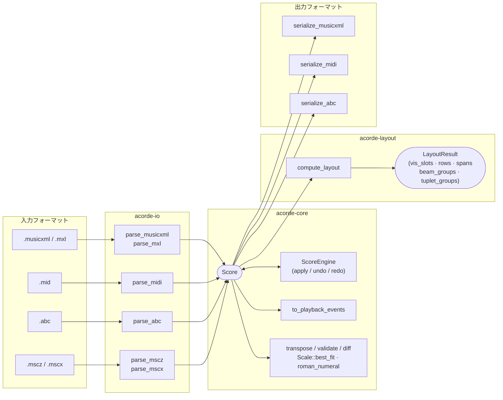
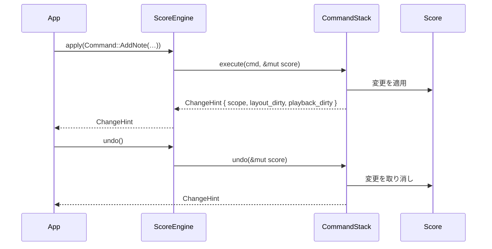

# acorde

> Rust および WebAssembly 向けのプラットフォーム非依存楽譜ライブラリ

[](https://crates.io/crates/acorde)
[](https://docs.rs/acorde)
[](https://github.com/kent-tokyo/acorde/actions/workflows/ci.yml)


---

## 概要

**acorde** は楽譜処理パイプライン全体をカバーする純 Rust ライブラリです。

スコアモデル · コマンドエンジン · MusicXML/MIDI/ABC I/O · 論理レイアウト · WebAssembly バインディング · CLI

コアクレートは UI 依存ゼロ・ファイルシステムアクセスなし — レンダラーやホストアプリケーション（デスクトップ・Web・サーバー）がライブラリを使用し、I/O は境界で処理します。

<!-- 楽譜エディタ（MusicLav 等）のスクリーンショットをここに置いてください -->
<!-- 例:  -->

---

## アーキテクチャ

### パイプライン



### スコアデータモデル

```
Score
├── metadata  { title, composer, lyricist, copyright, … }
├── settings  { tempo_bpm, time_signature, key_signature }
├── part_groups  Vec<PartGroup>
└── parts     Vec<Part>
    ├── midi_channel / midi_program
    └── staves  Vec<Staff>
        ├── clef（音部記号）
        ├── transpose_semitones（移調楽器）
        └── measures  Vec<Measure>
            ├── time_sig / key_sig / clef / tempo
            ├── barline_left / barline_right
            ├── volta / rehearsal / navigation / expression_text
            └── voices  [Vec<Note>; 4]（4声部固定）
                └── Note
                    ├── pitches       Vec<Pitch>  (和音 = 複数ピッチ)
                    ├── duration / dot_count / tuplet
                    ├── is_rest / is_grace / is_cue
                    ├── tie_start / slur_start / hairpin_start / ottava_start
                    ├── dynamic / articulations / lyric / chord_symbol
                    ├── stem_up / note_head / fingering / technique_text
                    └── guitar_technique / arpeggiate / trill_line_start
```

### コマンドフロー（Undo / Redo）



---

## acorde を採用するメリット

### 編集履歴がファーストクラス
すべての編集操作は `CommandStack` に格納される JSON シリアライズ可能な `Command` enum です。
undo/redo がそのまま動くだけでなく、履歴をディスクに永続化・決定的にリプレイ・ネットワーク越しにストリーミングするのも追加インフラ不要で実現できます。

### ネイティブとブラウザで同じコードが動く
`acorde-core` と `acorde-io` は変更なしに WebAssembly へコンパイルできます。
サーバーサイドの MusicXML パーサーとブラウザ上のエディタが同一のビジネスロジックを共有できます。

### 必要なものだけ取り込む
`acorde-io` のフィーチャーは独立したフラグ — `musicxml`・`midi`・`abc`・`mscz` を個別に選べます。
`acorde-core` は I/O クレートに一切依存せず、リソースが限られた環境にも組み込めます。

---

## 他ツールとの比較

楽譜処理エコシステムには用途ごとに最適化された成熟したツールが複数あります。
よく選ばれる代替手段との比較を以下に示します。

| | acorde | [music21] | [VexFlow] | [OSMD] | [jFugue] |
|---|---|---|---|---|---|
| **主要言語** | Rust | Python | JavaScript | TypeScript | Java |
| **ブラウザ動作** | ✓（WASM） | ✗ | ✓ | ✓ | ✗ |
| **スコアデータモデル** | ✓ | ✓ | 部分的¹ | ✗ | ✓ |
| **MusicXML 読み書き** | ✓ | ✓ | ✗ | 読み込みのみ | ✗ |
| **MIDI 読み書き** | ✓ | ✓ | ✗ | ✗ | ✓ |
| **ABC 記譜** | ✓ | ✓ | ✗ | ✗ | ✗ |
| **Undo/Redo 内蔵** | ✓ | ✗ | ✗ | ✗ | ✗ |
| **編集履歴のシリアライズ** | ✓ | ✗ | ✗ | ✗ | ✗ |
| **プレイバックイベント生成** | ✓ | ✗ | ✗ | ✗ | ✓ |
| **レンダラー非依存レイアウト** | ✓ | ✗ | ✗ | ✗ | ✗ |
| **音楽理論解析** | ✓ | ✓✓✓ | ✗ | ✗ | 基本 |
| **GC なし** | ✓ | ✗ | ✗ | ✗ | ✗ |
| **ランタイム不要・組み込み可** | ✓ | ✗ | ✗ | ✗ | ✗ |

[music21]: https://web.mit.edu/music21/
[VexFlow]: https://www.vexflow.com/
[OSMD]: https://opensheetmusicdisplay.org/
[jFugue]: http://www.jfugue.org/

¹ VexFlow の `StaveNote`・`Beam` 等のオブジェクトモデルは SVG/Canvas レンダラーと密結合しており、
  単独でシリアライズ・ミュータブル操作できるデータレイヤーとしては設計されていません。

### acorde を選ぶべき場面

**以下の条件に当てはまる場合、acorde が最適です：**

- **Rust または WebAssembly** をターゲットにしている — ネイティブデスクトップ・サーバーサイド処理・ブラウザエディタを同一バイナリで動かしたい。
- **1 ライブラリでパイプライン全体** を完結させたい — MusicXML のパース・コマンド実行・MIDI エクスポート・レイアウトヒント計算・プレイバックイベント生成を個別パッケージの接合なしに行う。
- **Undo/Redo とクラッシュリカバリが必要** — すべての編集操作はシリアライズ可能な `Command` です。履歴を永続化して決定的にリプレイでき、外部の状態管理フレームワークは不要。
- **AI や一括編集** — `batch_apply_labeled()` で任意のコマンド列を単一の Undo ステップとして適用でき、AI によるスコア編集が自然に実装できる。
- **レンダラーを選ばない** — `LayoutResult` はピクセルではなく論理座標（行・列スロットインデックス、解決済みのスパン端点）を返すため、VexFlow・Canvas・ネイティブ UI のいずれにも同じデータで対応できる。

### 他ツールを選ぶべき場面

- **深い音楽理論解析**（ローマ数字分析・声部進行・コーパス研究）が主目的なら **music21** を選んでください。解析ツールキットの充実度は比類なく、研究用途の Python エコシステムとも相性が抜群です。
- **表示のみで編集不要**：静的な MusicXML ファイルをブラウザで見せるだけなら **OSMD** が手軽で完成度が高い選択肢です。
- **ビルドステップなしの JavaScript**：`<script>` タグに直接組み込みたい場合は **VexFlow** や **abc.js** が向いています。acorde は WASM ビルドパイプラインが必要です。
- **JVM エコシステム**：Java/Kotlin プロジェクトなら **jFugue** が自然な選択です。

---

## ワークスペース構成

```
acorde/
  Cargo.toml              # ワークスペース
  crates/
    core/                 # スコアモデル + ScoreEngine（I/O なし・レイアウトなし）
    io/                   # MusicXML / MIDI / ABC パーサー & シリアライザー
    layout/               # 論理レイアウトエンジン
    wasm/                 # wasm-bindgen バインディング
    cli/                  # フォーマット変換 CLI
  tests/
    fixtures/             # サンプル .musicxml / .mid / .abc ファイル
```

---

## クレート

### `acorde`

アンブレラクレート — これ単体を依存に追加すれば `acorde-core` / `acorde-io` / `acorde-layout` を
`acorde::core` / `acorde::io` / `acorde::layout` として利用できます。

### `acorde-core`

スコアデータモデルとコマンドエンジン。I/O なし、レイアウトなし。

```rust
use acorde_core::{
    Score, ScoreEngine, Command,
    SetTempoCmd, SetMidiInstrumentCmd, SetTransposeCmd, SetTempoAtMeasureCmd,
    transpose, to_playback_events,
};

let mut engine = ScoreEngine::new();
engine.apply(Command::SetTempo(SetTempoCmd { bpm: 140 }))?;
engine.undo()?;
engine.redo()?;

// スコアを完全5度（7半音）移調
let transposed = transpose(engine.score(), 7);

// Bb クラリネット（移調楽器）として設定 — 記譜 C4 → 実音 Bb3
engine.apply(Command::SetTranspose(SetTransposeCmd {
    part_index: 0, staff_index: 0, semitones: -2,
}))?;

// パートの MIDI チャンネルとプログラムを変更
engine.apply(Command::SetMidiInstrument(SetMidiInstrumentCmd {
    part_index: 0, midi_channel: 1, midi_program: 40, // バイオリン
}))?;

// 4小節目からテンポを変更
engine.apply(Command::SetTempoAtMeasure(SetTempoAtMeasureCmd {
    measure_index: 3, bpm: Some(160),
}))?;

// 2つのスコアのパートを結合（短いほうはパディング）
let combined = score_a.merge(&score_b);

// オーディオエンジン向けプレイバックイベントを生成
use acorde_core::PlaybackOptions;
let events = to_playback_events(engine.score(), &PlaybackOptions {
    bpm_override: None,
    muted_parts: vec![],
});
// PlaybackEvent: time_beats, time_secs, pitch_midi, velocity, duration_beats, duration_secs, part_index
// pitch_midi には Staff.transpose_semitones が適用済み
// time_secs はテンポ変化をまたいでも正確に累積計算
```

**公開型：** `Score` · `Part` · `Staff` · `Measure` · `Note` · `Pitch` · `Step` ·
`Duration` · `Clef` · `KeySignature` · `TimeSignature` · `Dynamic` · `Articulation` ·
`Barline` · `HairpinKind` · `OttavaKind` · `Lyric` · `ChordSymbol` · `NoteHead` · `GuitarTechnique` ·
`PartGroup` · `PartGroupSymbol` · `ScoreTemplate` ·
`ScoreEngine` · `Command` · `CommandStack` · `ScoreStats` · `PlaybackEvent` ·
`Interval` · `IntervalQuality` · `Scale` · `ScaleKind` ·
`ValidationError` · `ValidationWarning` · `ValidationReport`

**コマンド（53種）：** `AddNote` · `AddPitch` · `DeleteNote` · `AddMeasure` · `DeleteMeasure` ·
`SetTempo` · `NewScore` · `AddHairpin` · `ToggleTie` · `SetDynamic` · `ToggleArticulation` ·
`SetKeySignature` · `SetTimeSignature` · `SetBarline` · `AddPart` · `DeletePart` ·
`SetMetadata` · `SetRehearsalMark` · `SetNavigationMark` · `SetChordSymbol` · `SetGrace` ·
`SetOttava` · `SetLyric` · `SetMultiRest` · `AddPedal` · `SetVolta` · `SetClef` ·
`SetPartName` · `SetMidiInstrument` · `SetTranspose` · `SetTempoAtMeasure` · `PasteVoice` ·
`PasteRange` · `SetSystemBreak` · `SetPageBreak` · `ToggleSlur` · `AddStaff` · `DeleteStaff` ·
`SetTuplet` · `RespellScore` · `RespellScoreToKey` · `SetStem` · `SetArpeggio` ·
`SetTechniqueText` · `SetFingering` · `SetStringNumber` · `SetNoteHead` · `SetCue` ·
`SetGuitarTechnique` · `SetExpressionText` · `ToggleTrillLine` · `SetPartGroup` · `Batch`

**関数：** `transpose(score, semitones)` · `to_playback_events(score, options)` ·
`measure_sequence(score)` · `validate(score)` · `Score::statistics()` ·
`Score::extract_part(n)` · `Score::merge(other)` · `Score::diff(a, b)` ·
`program_name(n)` · `drum_name(n)` · `interval_between(p1, p2)` ·
`detect_chord(pitches)` · `roman_numeral(chord, key)` · `Scale::best_fit(pitches)`

**ChangeHint 型：** `ChangeHint` · `ChangeScope`（`Global` / `Part(usize)` / `Measures{…}`）
— `apply()` が返す軽量ヒント。レイアウトや再生イベントの再計算をスキップできる。

### `acorde-io`

フィーチャーゲート付きパーサー＆シリアライザー。ファイルシステムに触れません。

| フィーチャー | デフォルト | 内容 |
|-------------|-----------|------|
| `musicxml` | ✓ | MusicXML + MXL パーサー、MusicXML シリアライザー |
| `midi` | ✓ | MIDI パーサー + シリアライザー |
| `abc` | — | ABC 記譜パーサー + シリアライザー |
| `mscz` | — | MuseScore .mscz/.mscx パーサー |

```rust
use acorde_io::{parse_musicxml, serialize_musicxml, parse_midi, serialize_midi};
use acorde_io::parse_abc;          // feature = "abc" が必要
use acorde_io::{parse_mscz, parse_mscx}; // feature = "mscz" が必要

let score = parse_musicxml(xml_str)?;
let xml   = serialize_musicxml(&score)?;
// <midi-instrument> のチャンネルとプログラムがラウンドトリップで保持される

let score = parse_midi(midi_bytes)?;
let midi  = serialize_midi(&score)?;
// → Vec<u8>（SMF Type 1, PPQ = 480）
// Staff.transpose_semitones が全 MIDI ノートピッチに適用される
// Measure.tempo が設定されている小節にはテンポメタイベントが挿入される

let score = parse_mscz(mscz_bytes)?;   // .mscz（圧縮アーカイブ）
let score = parse_mscx(mscx_str)?;     // .mscx（生 XML）
// インポート対象: ピッチ（TPC）・音符長・休符・タイ・スラー・強弱記号・歌詞
//                 反復記号・ボルタ括弧・MuseScore 3.x/4.x 両フォーマット対応
```

### `acorde-layout`

論理レイアウト計算 — ピクセル値なし、CSS なし。

```rust
use acorde_layout::{LayoutConfig, compute_layout};

let config = LayoutConfig {
    measures_per_row: 4,
    concert_pitch: false,
    first_row_measures: None, // 1行目の小節数を個別指定できるオプション
};
let result = compute_layout(&score, &config);
// result.vis_slots              — 視覚列 → 物理小節インデックス（複数小節休止符対応）
// result.rows                   — 行ごとの小節リスト
// result.spans                  — ヘアピン / ペダル / オッターバの開始・終了インデックス解決済み
// result.concert_key_overrides  — 移調楽器のコンサートピッチ時の調号
// result.beam_groups            — 連桁グループ（レンダラー向けノートインデックス群）
// result.tuplet_groups          — 連符グループ（actual_notes / normal_notes 付き）
// result.courtesy_accidentals   — 注意臨時記号（表示が必要な臨時記号一覧）
```

### `acorde-wasm`

wasm-bindgen バインディング。`wasm-pack build` でビルドします。

```bash
wasm-pack build crates/wasm --target bundler
```

公開: `parse_musicxml` · `parse_mxl` · `serialize_musicxml` · `parse_midi` · `serialize_midi` ·
`serialize_midi_region(score_json, start, end)` · `parse_mscz` · `parse_mscx` ·
`parse_abc` · `serialize_abc` ·
`to_playback_events` · `to_playback_events_ex` · `compute_playback_position` ·
`compute_layout(score_json, measures_per_row, concert_pitch)` · `compute_layout_ex` ·
`gm_program_name(n)` · `gm_drum_name(n)` ·
`validate_score` · `transpose_score` · `extract_part` · `merge_scores` · `diff_scores` ·
`score_statistics` · `score_duration_secs` · `score_duration_secs_region` ·
`respell_score` · `respell_score_to_key` · `measure_beats_remaining` ·
`pitch_from_midi` · `pitch_from_str` · `interval_between` ·
`key_alter_for_step` · `key_contains_pitch` · `key_display_name` ·
`clef_middle_line_midi` · `suggested_stem_up` · `compute_beams` · `command_key_from_json` ·
`detect_chord` · `roman_numeral` · `best_fit_scale` ·
`render_score_svg` · `render_score_svg_with_layout` · `render_score_svg_row` · `render_score_metadata` ·
`ScoreEngine`（JS クラス；`apply()` / `undo()` / `redo()` は `ChangeHint` JSON を返す）:
  `apply_batch` · `apply_batch_labeled` · `copy_voice` / `paste_voice` · `copy_range` / `paste_range` ·
  `get_undo_label` / `get_redo_label` · `get_undo_key` / `get_redo_key` ·
  `export_history` / `restore_history`

ブラウザ描画契約は [`docs/browser-rendering.md`](docs/browser-rendering.md)、対応環境は
[`docs/browser-support.md`](docs/browser-support.md)、性能確認は
[`docs/performance.md`](docs/performance.md) を参照してください。

### `acorde-cli`

```bash
cargo install acorde-cli
```

```bash
acorde convert  input.mid output.musicxml
acorde convert  input.musicxml output.mid
acorde convert  input.mscz output.musicxml    # --features mscz ビルドが必要
acorde info     input.musicxml          # タイトル・パート数・小節数・ノート数・演奏時間
acorde validate input.musicxml          # 構造バリデーション、エラー時は exit 1
acorde extract  --part 0 input.musicxml violin.musicxml
```

---

## はじめかた

手軽に使うなら、アンブレラクレート `acorde` を追加してください — `acorde-core` / `acorde-io` /
`acorde-layout` をそれぞれ `acorde::core` / `acorde::io` / `acorde::layout` として再エクスポートします：

```toml
[dependencies]
acorde = "0.4"

# ABC 記譜サポート（オプトイン）
acorde = { version = "0.4", features = ["abc"] }

# MuseScore .mscz/.mscx サポート（オプトイン）
acorde = { version = "0.4", features = ["mscz"] }
```

もしくは各クレートを個別に追加：

```toml
[dependencies]
acorde-core = "0.4"
```

I/O サポートが必要な場合：

```toml
acorde-io = "0.4"

# ABC 記譜サポート（オプトイン）
acorde-io = { version = "0.4", features = ["abc"] }

# MuseScore .mscz/.mscx サポート（オプトイン）
acorde-io = { version = "0.4", features = ["mscz"] }
```

---

## ビルド

**前提条件：** Rust 1.87+

```bash
git clone https://github.com/kent-tokyo/acorde.git
cd acorde
cargo build --all
cargo test --all
cargo clippy --all -- -D warnings
```

WebAssembly ビルド：

```bash
cargo install wasm-pack
wasm-pack build crates/wasm --target bundler
wasm-pack test crates/wasm --headless --chrome
```

---

## 設計制約

| ルール | 適用範囲 |
|--------|---------|
| 非同期ランタイム（`tokio`）禁止 | core · io · layout |
| `std::fs` 禁止 | core · io · layout |
| ピクセル値・CSS・レンダラー固有型禁止 | 全クレート |
| `core` は `io` / `layout` に依存してはならない | core |
| 公開パスでの `panic!` / `unwrap` 禁止 | 全クレート |

---

## テスト

```bash
cargo test --all                           # ユニットテスト + 統合テスト（467件）
cargo test -p acorde-io --features abc   # ABC パーサー + シリアライザーテスト
cargo test -p acorde-io --features mscz  # MSCZ パーサーテスト（69ユニット + 28ラウンドトリップ）
```

すべてのパーサーは `crates/io/tests/roundtrip.rs` にラウンドトリップテストを持ちます。
0 バイトや不正なデータを渡した場合、`Err` を返し panic しないことを保証します。

---

## ライセンス

acorde は **MIT** または **Apache-2.0** のデュアルライセンスです（選択可能）— 詳細は [LICENSE-MIT](LICENSE-MIT) と [LICENSE-APACHE](LICENSE-APACHE) を参照してください。
